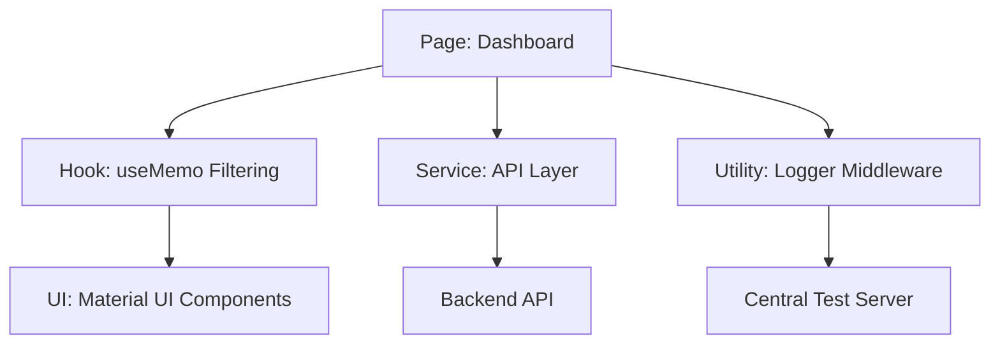

# 🎓 Campus Notifications - Priority Inbox Dashboard

[](https://nextjs.org/)
[](https://www.typescriptlang.org/)
[](https://mui.com/)
[](https://www.framer.com/motion/)

> **A high-performance, algorithmically-driven notification management system designed for campus placement and event tracking.**

---

## 🌟 Executive Summary
This project represents a full-stack solution for managing critical campus updates. The core differentiator is the **Priority Ranking Algorithm**, which ensures students never miss high-stakes notifications (like Placements or Results) amidst routine campus events.

### 🎯 Key Evaluation Highlights
*   **Algorithmic Excellence**: Implemented a weighted ranking system combining Business Logic (Priority Weights) and Recency (Timestamps).
*   **Production-Ready Observability**: Integrated a custom logging middleware that tracks API calls, state changes, and component lifecycle in real-time.
*   **User-Centric UX**: Features "Smart Read" tracking using local persistence and smooth micro-animations for high engagement.
*   **Architectural Integrity**: Built with a clean separation of concerns, utilizing custom hooks, API services, and a centralized theme registry.

---

## 🚀 Core Features

### 1. Priority Inbox (The Brain)
The system doesn't just list notifications; it ranks them.
*   **Weighting System**: 
    *   🔴 **Placements**: Weight 3 (Critical)
    *   🔵 **Results**: Weight 2 (Important)
    *   🟢 **Events**: Weight 1 (Standard)
*   **Tie-Breaking**: Notifications with the same weight are sorted by most recent timestamp.

### 2. Intelligent Filtering & State
*   **Category Tabs**: Instant filtering between Placements, Results, and Events.
*   **Read/Unread Persistence**: Uses `localStorage` to persist "Read" status across sessions without backend overhead.
*   **Priority Toggle**: A one-tap switch to focus only on the Top 10 most critical updates.

### 3. Responsive & Premium Design
*   **Mobile-First**: Fully responsive layout optimized for students on the go.
*   **Dynamic UI**: Hover effects, smooth transitions, and conditional styling (e.g., higher elevation for unread items).

---

## 🛠 Tech Stack & Architecture

### Frontend Architecture


*   **Framework**: Next.js 15 (App Router)
*   **Styling**: Material UI (MUI) with Custom Theme Registry
*   **Animations**: Framer Motion for micro-interactions
*   **State Management**: React Hooks (useState, useMemo, useEffect)
*   **Data Fetching**: Axios with interceptor-ready logging

---

## 📡 Observability & Logging
Every critical action is logged via our custom `logging_middleware`. This provides deep visibility into:
-   **API Lifecycle**: Track success/failure of notification fetching.
-   **User Behavior**: Monitor which filters are most used.
-   **System Health**: Debug state transitions in production.

---

## ⚙️ Getting Started

### Prerequisites
- Node.js 18+
- npm / yarn

### Installation
1.  **Clone and Navigate**:
    ```bash
    cd notification_app_fe
    ```
2.  **Install Dependencies**:
    ```bash
    npm install
    ```
3.  **Run Development Server**:
    ```bash
    npm run dev
    ```
4.  **View App**: Open [http://localhost:3000](http://localhost:3000)

---

## 👨‍💻 Evaluation Context
This project was developed for the **Campus Hiring Evaluation**. It demonstrates proficiency in:
1.  **Complex State Logic**: Handling multi-dimensional filtering and sorting.
2.  **Performance Optimization**: Using `useMemo` for heavy algorithmic sorting.
3.  **System Design**: Integrating middleware across multiple packages.
4.  **UI/UX Best Practices**: Following Material Design guidelines for accessibility and clarity.

---

**Developed with ❤️ for the Campus Evaluation Team.**
